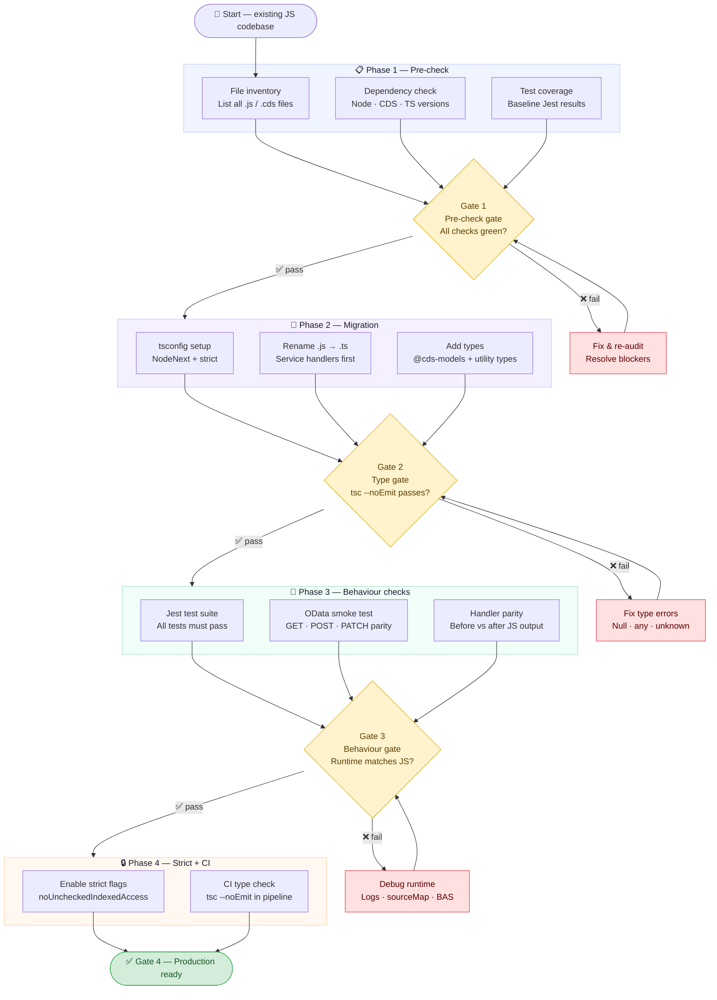

# SAP CAP — TypeScript Migration Guide

> **Code by Anubhav Trainings**

---

## Migration Flow



---

## Phase 1 — Pre-check

> *Audit your existing JS codebase before touching anything.*

Before starting the conversion, you need a clear picture of what you are migrating. This phase produces a baseline — a snapshot of your project's health that you compare against after migration.

### What to check

| Check | Purpose | Tool |
|---|---|---|
| File inventory | List all `.js` and `.cds` files | `find src -name "*.js"` |
| Dependency check | Verify Node, CDS, TypeScript versions | `npm list` |
| Test coverage | Capture baseline pass/fail counts | `npx jest --coverage` |

### Baseline Jest run — capture before you start

```bash
npx jest --coverage > baseline-results.txt
```
> <sub>Code by Anubhav Trainings</sub>

---

## Gate 1 — Pre-check Gate

> **Decision point:** Are all pre-checks green? If yes, proceed. If no, fix blockers and re-audit.

> [!IMPORTANT]
> Do **not** begin file renaming or tsconfig changes until Gate 1 is clean. Migrating on top of broken tests or wrong Node versions causes compounding failures that are hard to trace.

**Common blockers at Gate 1**

- Node version below 18 (CAP TypeScript requires Node 18+)
- `@sap/cds` version below 7 (older versions lack `.cds` type generation)
- Zero Jest tests — you have no baseline to validate against after migration

---

## Phase 2 — Migration

> *Convert `.js` → `.ts` incrementally, one service handler at a time.*

### Step 1 — Install TypeScript dependencies

```bash
npm install typescript --save-dev
npm install ts-node tsx @types/node --save-dev
npm install @cap-js/cds-types --save-dev
npm install reflect-metadata
```
> <sub>Code by Anubhav Trainings</sub>

---

### Step 2 — tsconfig.json for CAP

```jsonc
{
  "compilerOptions": {
    "target": "ESNext",
    // Latest JS — Node 18/20 on BTP supports it natively

    "module": "NodeNext",
    // Supports both CJS and ESM — required for modern CAP

    "moduleResolution": "NodeNext",
    // Must match "module" — resolves @sap/cds exports map correctly

    "esModuleInterop": true,
    // import cds from '@sap/cds' works cleanly (SAP packages are CJS)

    "forceConsistentCasingInFileNames": true,
    // Develop on Windows, deploy to Linux BTP — prevents crash on deploy

    "strict": true,
    // Enables all 8 strict checks — noImplicitAny, strictNullChecks etc.

    "skipLibCheck": true,
    // Skip checking node_modules .d.ts — speeds up compile significantly

    "sourceMap": true,
    // Maps compiled JS back to .ts — breakpoints work in BAS and VS Code

    "allowJs": true,
    // Legacy .js handlers work alongside new .ts files during migration

    "paths": {
      "@sap/cds": ["./node_modules/@cap-js/cds-types"],
      // Redirect to better community-maintained CAP types

      "#cds-models/*": ["./@cds-models/*"]
      // Auto-generated entity types from cds build/watch
    }
  },
  "exclude": ["eslint.config.mjs"]
  // ESLint config is ESM — exclude to avoid false TS errors
}
```
> <sub>Code by Anubhav Trainings</sub>

---

### Step 3 — Rename handlers

Rename one service file at a time. Start with the simplest handler.

```bash
# rename a single handler
mv srv/book-service.js srv/book-service.ts

# generate CDS model types (run after every .cds schema change)
npx cds-typer "*" --outputDirectory ./@cds-models
```
> <sub>Code by Anubhav Trainings</sub>

---

### Step 4 — Add types to handler

```typescript
import cds from '@sap/cds';
import type { Request } from '@sap/cds';

// Import auto-generated entity type from cds-typer output
import { Books } from '#cds-models/sap/capire/bookshop';

export class BookService extends cds.ApplicationService {

  override async init(): Promise<void> {

    // ✅ req is fully typed — no implicit any
    this.on('READ', Books, async (req: Request) => {
      const books: Books[] = await SELECT.from(Books);
      //    ^^^^^ typed from your .cds schema — not any
      return books;
    });

    await super.init();
  }
}
```
> <sub>Code by Anubhav Trainings</sub>

---

## Gate 2 — Type Gate

> **Decision point:** Does `tsc --noEmit` pass with zero errors? If yes, proceed. If no, fix type errors.

```bash
# Run type check — no output files generated, errors only
npx tsc --noEmit
```
> <sub>Code by Anubhav Trainings</sub>

> [!NOTE]
> `tsc --noEmit` is your type gate command. Add it to your `package.json` scripts and your CI pipeline. It checks types without writing any `.js` files — fast and safe.

### Common type errors at Gate 2

| Error | Cause | Fix |
|---|---|---|
| `'req' implicitly has type 'any'` | `noImplicitAny` | Add `req: Request` type annotation |
| `Object is possibly 'null'` | `strictNullChecks` | Add `?.` or `?? fallback` |
| `Property 'id' does not exist on 'unknown'` | `req.body` is `unknown` | Use type guard or `as` cast |
| `'PORT' from index signature` | `noPropertyAccessFromIndexSignature` | Use `process.env['PORT']` |

---

## Phase 3 — Behaviour Checks

> *Verify that your TypeScript code produces identical runtime output to the original JavaScript.*

This phase is not about TypeScript — it is about your application logic. The TypeScript compiler can be satisfied while your handler still returns wrong data. These three checks catch that.

### Jest test suite

```bash
# Run full suite and compare against baseline-results.txt
npx jest --verbose

# Run specific CAP service test
npx jest book-service.test.ts --verbose
```
> <sub>Code by Anubhav Trainings</sub>

---

### OData smoke test

```bash
# GET — read all books
curl http://localhost:4004/odata/v4/catalog/Books

# POST — create a book
curl -X POST http://localhost:4004/odata/v4/catalog/Books \
  -H "Content-Type: application/json" \
  -d '{"title": "TypeScript CAP", "price": 29.99, "stock": 100}'

# PATCH — update a book
curl -X PATCH http://localhost:4004/odata/v4/catalog/Books\(1\) \
  -H "Content-Type: application/json" \
  -d '{"price": 24.99}'
```
> <sub>Code by Anubhav Trainings</sub>

---

> [!WARNING]
> **Handler parity check** — run your JS version side by side with your TS version on the same request payload and compare the JSON responses byte for byte. Any difference in field names, types, or structure is a regression introduced during migration.

---

## Gate 3 — Behaviour Gate

> **Decision point:** Does runtime output match the original JS version exactly? If yes, proceed. If no, debug and fix.

### Debugging tools when Gate 3 fails

| Tool | How to use |
|---|---|
| `sourceMap: true` | BAS breakpoints work on original `.ts` lines |
| `cds watch` logs | CDS runtime logs show handler execution order |
| BTP CF logs | `cf logs <app-name> --recent` references `.ts` line numbers via sourceMap |
| `console.log` diff | Log `JSON.stringify(result)` in both JS and TS, compare |

---

## Phase 4 — Strict + CI Hardening

> *Enable additional strict flags and wire type checking into your pipeline.*

### Additional strict flags for a fully hardened project

```jsonc
{
  "compilerOptions": {
    "strict": true,
    // already enabled in Phase 2

    "noUncheckedIndexedAccess": true,
    // arr[0] returns T | undefined — forces null handling on all index access
    // This is what caused req.params.id error — fix: req.params['id'] ?? ''

    "exactOptionalPropertyTypes": true,
    // { bio?: string } means absent or string — not undefined explicitly

    "noImplicitReturns": true,
    // All code paths must return — catches missing return in handlers

    "noUnusedLocals": true,
    // Declared variables must be used — prefix with _ to suppress

    "noUnusedParameters": true,
    // Function params must be used — prefix unused ones with _
    // function handler(_req: Request, res: Response) — _req is intentional

    "noFallthroughCasesInSwitch": true,
    // switch-case must end with break / return / throw

    "noPropertyAccessFromIndexSignature": false
    // Keep false — process.env.PORT would require bracket notation everywhere
  }
}
```
> <sub>Code by Anubhav Trainings</sub>

---

### Wire into package.json

```jsonc
{
  "scripts": {
    "dev":          "tsx watch srv/server.ts",
    "build":        "tsc",
    "typecheck":    "tsc --noEmit",
    "test":         "jest",
    "test:ci":      "tsc --noEmit && jest --coverage",
    "clean":        "rm -rf dist gen"
  }
}
```
> <sub>Code by Anubhav Trainings</sub>

---

### CI/CD pipeline step (GitHub Actions example)

```yaml
name: TypeScript type check

on: [push, pull_request]

jobs:
  typecheck:
    runs-on: ubuntu-latest
    steps:
      - uses: actions/checkout@v4
      - uses: actions/setup-node@v4
        with:
          node-version: '20'
      - run: npm ci
      - run: npm run typecheck
      # tsc --noEmit — fails the pipeline if any type errors exist
      - run: npm test
      # Jest — fails the pipeline if any tests regress
```
> <sub>Code by Anubhav Trainings</sub>

---

## Gate 4 — Production Ready

> **Final sign-off.** All four gates are clean. Deploy to BTP Cloud Foundry.

```bash
# Build and deploy to BTP
npm run build
cf push
```
> <sub>Code by Anubhav Trainings</sub>

> [!TIP]
> After deploying, verify sourceMap is working on BTP by triggering a known error and checking that `cf logs` shows `.ts` file references with correct line numbers — not compiled `.js` references.

---

## Quick Reference — All Gate Commands

| Gate | Command | Pass condition |
|---|---|---|
| Gate 1 — Pre-check | `npx jest --coverage` | Tests exist, baseline captured |
| Gate 2 — Type gate | `npx tsc --noEmit` | Zero type errors |
| Gate 3 — Behaviour | `npx jest && curl <odata-endpoint>` | All tests pass, OData parity confirmed |
| Gate 4 — Production | `npm run build && cf push` | Deployed, logs show `.ts` references |

---

## Utility Types Used in This Migration

| Type | Used for |
|---|---|
| `Partial<User>` | PATCH request body — all fields optional |
| `Omit<User, 'id'>` | POST request body — id is auto-generated |
| `Pick<User, 'username'\|'email'>` | Public API response — hide sensitive fields |
| `Readonly<User>` | In-memory DB records — prevent mutation |
| `Record<string, unknown>` | Type-safe access to unknown objects (req.body, error objects) |

---

## Key tsconfig Properties — CAP Specific

| Property | Value | Why |
|---|---|---|
| `module` | `NodeNext` | CAP mixes CJS + ESM packages |
| `moduleResolution` | `NodeNext` | Resolves `@sap/cds` exports map |
| `paths[@sap/cds]` | `@cap-js/cds-types` | Better CAP types, richer intellisense |
| `paths[#cds-models/*]` | `./@cds-models/*` | Generated entity types from `.cds` schema |
| `forceConsistentCasingInFileNames` | `true` | Windows dev → Linux BTP deploy safety |
| `sourceMap` | `true` | BAS breakpoints, BTP log line references |

---

<div align="center">

---

*Built with ❤️ for SAP developers*

**Code by Anubhav Trainings**

</div>
