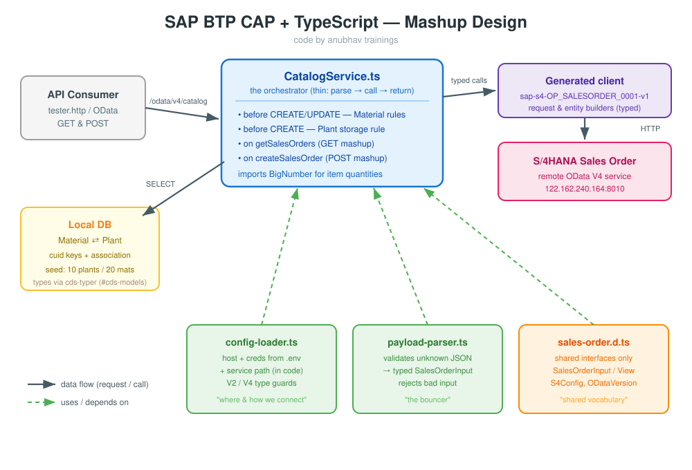

# SAP BTP CAP + TypeScript — End-to-End Developer Guide

### A complete, school-friendly walkthrough of building a TypeScript CAP application on SAP BTP that mashes up a local domain model with a remote S/4HANA Sales Order service.

---

## 🧾 Cheat Sheet (read this first)

| What | Command / File | Used in |
|------|----------------|---------|
| Create CAP project | `cds init <name> --add typescript` | Step 1 |
| Add TS to existing project | `cds add typescript` | Step 1 |
| CAP type definitions | `npm i -D @cap-js/cds-types` | Step 1 |
| Generate seed data (CSV) | `cds add data` (10 plants, 20 materials) | Step 1 |
| Run TS directly | `npx ts-node srv/server.ts` / `cds watch` | Step 1 |
| Compile for deploy | `npx tsc` (wired into `npm run build`) | Step 1 |
| Deploy to Cloud Foundry | `cf push` / `mbt build` + `cf deploy` | Step 1 |
| Install SDK generator | `npm i -D @sap-cloud-sdk/generator` | Step 2 |
| Install OData V4 runtime | `npm i @sap-cloud-sdk/odata-v4` | Step 2 |
| Generate typed client | `npx generate-odata-client --input srv/external --outputDir srv/src/generated` | Step 2 |
| Secrets / URLs | `.env` file (never commit) | Step 2 |
| Type guards & parsers | `config-loader.ts`, `payload-parser.ts`, `*.d.ts` | Step 3 |
| BTP Destination | `cf create-service destination ...` + service key | Step 4 |
| Decimal quantities | `npm i bignumber.js` | Step 3 |
| Manual API testing | `srv/tester.http` (REST Client) | Step 4 |

**code by anubhav trainings**

---

## 🎯 The Business Use Case

We are building **one CAP service** that does two jobs at the same time:

<em>💡 A "mashup" service is one CAP service that combines <strong>local data</strong> (stored in our own database) with <strong>remote data</strong> (read live from another SAP system). To the consumer it looks like a single API.</em>

### Part A — Local Domain Model (Step 1)

Two tiny entities that live in **our** database, linked by an **association**:

- **Material** — 4 fields + a `cuid` key (auto-generated UUID); `plant` is an association to Plant.
- **Plant** — 4 fields + a `cuid` key.

We also generate **seed/test data** with `cds add data` — **10 plants** and **20 materials** in CSV files — so the database is never empty when we test.

On top of these entities we attach **three business rules** (event handlers) written in `CatalogService.ts`:

1. **Before CREATE Material** → the material name must be **40 characters long** and must **not start with a number**.
2. **Before UPDATE Material** → the referenced **Plant must already exist** before we change material data.
3. **Before CREATE Plant** → **only 2 plants** are allowed to share the **same storage location**.

### Part B — Remote S/4HANA Mashup (Steps 2–4)

We connect to a live **S/4HANA Sales Order** OData service and expose it through the same CAP application using **fully typed, generated client code** (no hand-written interfaces).

- Remote service: `http://122.162.240.164:8010/.../SalesOrder`
- We generate a typed client from the service's **EDMX** metadata.
- We consume **GET** (read sales orders) and **POST** (create a sales order) operations.

---

## 🗺️ The Four Phases

<table style="border-collapse: collapse; width: 100%;">
<tr style="background-color: #f5f5f5;">
<th style="border: 1px solid #ddd; padding: 8px; text-align: left;">Phase</th>
<th style="border: 1px solid #ddd; padding: 8px; text-align: left;">Goal</th>
<th style="border: 1px solid #ddd; padding: 8px; text-align: left;">You will end with</th>
</tr>
<tr>
<td style="border: 1px solid #ddd; padding: 8px;"><strong>Step 1 — Scaffold</strong></td>
<td style="border: 1px solid #ddd; padding: 8px;">Create a TypeScript-first CAP project, wire up tooling, prove that local run AND cloud deploy work <em>before</em> any business logic.</td>
<td style="border: 1px solid #ddd; padding: 8px;">A running CAP app with associated Material + Plant entities, seed data (10 plants, 20 materials) and 3 typed handlers, deployed to Cloud Foundry.</td>
</tr>
<tr style="background-color: #f9f9f9;">
<td style="border: 1px solid #ddd; padding: 8px;"><strong>Step 2 — Generate</strong></td>
<td style="border: 1px solid #ddd; padding: 8px;">Use the S/4HANA Cloud SDK to turn the remote service's EDMX into TypeScript types and client classes.</td>
<td style="border: 1px solid #ddd; padding: 8px;">A <code>srv/src/generated</code> folder full of typed API clients.</td>
</tr>
<tr>
<td style="border: 1px solid #ddd; padding: 8px;"><strong>Step 3 — Implement</strong></td>
<td style="border: 1px solid #ddd; padding: 8px;">Write the TypeScript mashup handler that calls GET/POST using the generated types, with reusable parsers, type guards and <code>.d.ts</code> files.</td>
<td style="border: 1px solid #ddd; padding: 8px;">A clean, modular, fully typed consumption layer.</td>
</tr>
<tr style="background-color: #f9f9f9;">
<td style="border: 1px solid #ddd; padding: 8px;"><strong>Step 4 — Test</strong></td>
<td style="border: 1px solid #ddd; padding: 8px;">Connect locally to the real system through a BTP Destination and test GET/POST with an <code>.http</code> file.</td>
<td style="border: 1px solid #ddd; padding: 8px;">Verified end-to-end calls against live S/4HANA.</td>
</tr>
</table>

---

## 🧠 Why TypeScript for CAP? (the big idea)

<em>💡 In plain JavaScript, a typo like <code>req.data.materilName</code> only blows up at runtime — often in production. TypeScript catches that mistake while you are still typing, because it knows the exact shape of every entity and every remote API.</em>

Think of TypeScript as a **spell-checker for your data**. Just like a word processor underlines a misspelt word in red, TypeScript underlines a wrong field name, a missing argument, or a value of the wrong type — **before** the code ever runs.

In this guide, TypeScript types come from **two automatic sources**, so we almost never write interfaces by hand:

1. **`cds-typer`** generates types from our local `.cds` model (`#cds-models/...`).
2. **The S/4HANA Cloud SDK generator** generates types from the remote EDMX metadata.

---

## 🧩 Why we create each TypeScript file

<em>💡 We do not put everything in one big file. Each <code>.ts</code> file has <strong>one job</strong> (the "single responsibility" idea). Small, focused files are easier to read, test and reuse — and TypeScript can check the contract <em>between</em> them.</em>

The diagram below shows how the files fit together — the CAP service in the middle, leaning on small helper files, and talking to S/4HANA through the generated client:

**code by anubhav trainings**

<table style="border-collapse: collapse; width: 100%;">
<tr style="background-color: #f5f5f5;">
<th style="border: 1px solid #ddd; padding: 8px; text-align: left;">File</th>
<th style="border: 1px solid #ddd; padding: 8px; text-align: left;">Why it exists (its one job)</th>
</tr>
<tr>
<td style="border: 1px solid #ddd; padding: 8px;"><code>srv/CatalogService.ts</code></td>
<td style="border: 1px solid #ddd; padding: 8px;">The <strong>orchestrator</strong>. Registers the event handlers (the 3 local validations + the GET/POST mashup) and wires the small helpers together. It stays thin: parse → call → return.</td>
</tr>
<tr style="background-color: #f9f9f9;">
<td style="border: 1px solid #ddd; padding: 8px;"><code>srv/lib/config-loader.ts</code></td>
<td style="border: 1px solid #ddd; padding: 8px;">The <strong>connection settings</strong>. Reads host + credentials from <code>.env</code>, appends the fixed service path in code, validates nothing is missing, and exposes the V2/V4 type guards. One place owns "where and how we connect".</td>
</tr>
<tr>
<td style="border: 1px solid #ddd; padding: 8px;"><code>srv/lib/payload-parser.ts</code></td>
<td style="border: 1px solid #ddd; padding: 8px;">The <strong>bouncer</strong>. Turns untrusted incoming JSON into a clean, fully typed <code>SalesOrderInput</code>, rejecting bad input with a clear message. Keeps validation out of the handler.</td>
</tr>
<tr style="background-color: #f9f9f9;">
<td style="border: 1px solid #ddd; padding: 8px;"><code>srv/types/sales-order.d.ts</code></td>
<td style="border: 1px solid #ddd; padding: 8px;">The <strong>shared vocabulary</strong>. Holds the reusable interfaces (<code>SalesOrderInput</code>, <code>SalesOrderView</code>, <code>S4Config</code>, …) so every file agrees on the same shapes. Contains only types — it disappears at runtime.</td>
</tr>
<tr>
<td style="border: 1px solid #ddd; padding: 8px;"><code>srv/src/generated/…</code></td>
<td style="border: 1px solid #ddd; padding: 8px;">The <strong>typed S/4HANA client</strong> (auto-generated in Step 2). Provides the request/entity builders so calls to the remote service are fully type-safe — we never hand-write these interfaces.</td>
</tr>
</table>

📌 <strong>Note:</strong> The diagram loads from <code>./image/design.svg</code> (relative to this folder). If it does not render, create the file at <code>Day 3/developer_exercises/image/design.svg</code>.

**code by anubhav trainings**

---

## 📒 How to read every file in this guide

Each step file follows the same shape so it is easy for a beginner to follow:

- A **cheat sheet** at the very top.
- **Concepts** appear in green italic callouts — read these to understand *why*.
- **Snippet-by-snippet** build-up — small pieces first, then the whole.
- **Pink notes** flag the things people most often get wrong.
- Every **TypeScript** block is followed by its **(legacy) JavaScript** equivalent on a gray background, so JS developers can map old habits to new ones.
- The **final, complete code** for each file appears at the end of the step.

📌 <strong>Note:</strong> The legacy JavaScript blocks are for understanding only. In this project we write and ship <strong>TypeScript</strong>; the JS is what TypeScript compiles down to.

**code by anubhav trainings**

---

## ✅ What "done" looks like

By the end of all four steps you will be able to:

- Scaffold a TypeScript CAP project that runs locally **and** deploys to BTP Cloud Foundry.
- Write strongly typed CAP event handlers with real business validations.
- Generate a typed OData client from any SAP service's EDMX.
- Consume remote GET/POST calls safely, with reusable parsers and type guards.
- Wire a BTP Destination and test the full round-trip against a live S/4HANA system.

Move on to **`step1_scaffold_typescript_cap.md`** to begin.

**code by anubhav trainings**
