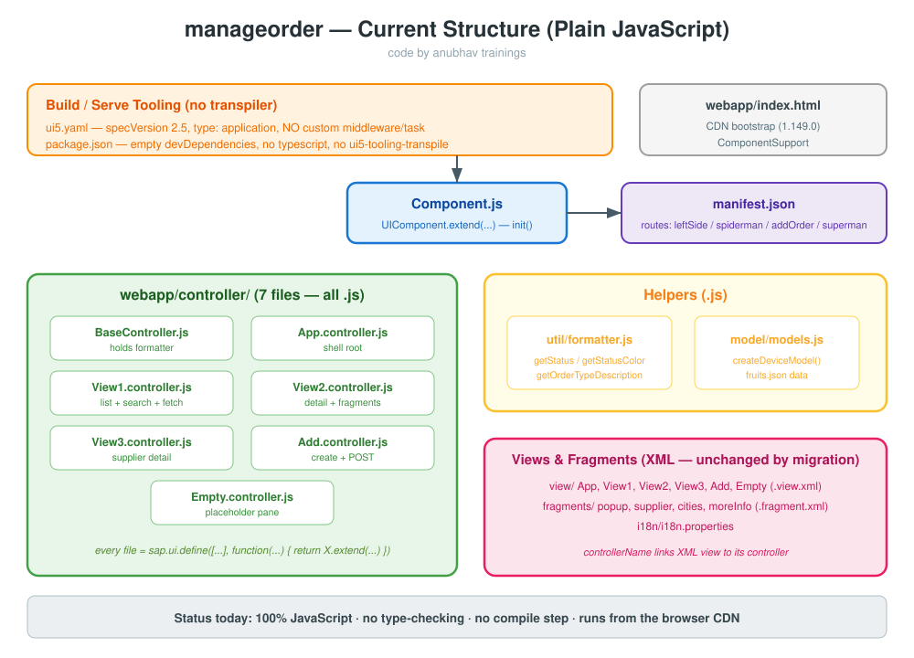

<h1 align="center">🚀 SAP BTP Fiori — JavaScript ➜ TypeScript Migration Guide</h1>

<em>Take the freestyle SAPUI5 app <code>manageorder</code> and convert it from plain JavaScript to TypeScript — one file at a time, without ever breaking the running app.</em>

<b>code by anubhav trainings</b>

---

## 🧾 Cheat Sheet (read this first)

| # | Phase | What you do | Files touched |
|---|-------|-------------|---------------|
| **1** | **Preparation** | Install `ui5-tooling-transpile` + `typescript`, wire `ui5.yaml`, add `tsconfig.json`, convert **one** controller to prove the hybrid setup | `package.json`, `ui5.yaml`, `tsconfig.json`, `Empty.controller.ts` |
| **2** | **Core files** | Rename `Component.js` ➜ `Component.ts` and `util/formatter.js` ➜ `util/formatter.ts`; verify hybrid app still renders | `Component.ts`, `util/formatter.ts` |
| **3** | **Controllers + Types** | Convert all controllers, add typed lifecycle hooks, create `types/datatype.d.ts`, type the JSON model + OData callbacks | `*.controller.ts`, `types/datatype.d.ts`, `model/models.ts` |
| **4** | **App Router** | Add `xs-app.json`, add the app + approuter module to `mta.yaml`, pass the type gate (`tsc --noEmit`) | `xs-app.json`, `mta.yaml` |

<em>💡 <strong>One golden rule:</strong> JavaScript and TypeScript files <strong>coexist</strong> in the same <code>webapp/</code> folder during the entire migration. You never have a "big bang" rewrite — you convert one file, refresh the browser, confirm it still works, then move to the next.</em>

---

## 🎯 The Use Case — what is `manageorder`?

`manageorder` is a **freestyle (hand-written) SAPUI5 application** that talks to a CAP service to manage Sales Orders. It is *not* a Fiori Elements template app — every screen and every line of controller logic is written by hand, which makes it a perfect, realistic candidate for a TypeScript migration.

What the app does:

- **View1** — shows a **list** of sales orders (loaded with `fetch()` from `/odata/v4/catalog/getSalesOrders()`), with a search field and an "Add" button.
- **View2** — shows the **detail** of one selected order, plus value-help popups for *Supplier* and *City* built from XML **fragments**.
- **View3** — shows the **supplier detail**.
- **Add** — a **create** form that builds a new order and `POST`s it to `createSalesOrder`.
- **App / Empty** — the shell root view and a placeholder pane.
- **BaseController** — a shared parent controller that exposes the **formatter**.
- **util/formatter.js** — converts status/type codes into readable text (e.g. `TA` ➜ "Standard Order").
- **model/models.js** — creates the standard `device` model.

---

## 🗺️ Where we start — Current Structure (all JavaScript)

📌 <strong>Note:</strong> Today there is <strong>no compiler and no type-checking</strong>. A typo like <code>oEvent.getParammeter(...)</code> only blows up at runtime, in the browser, when a user clicks the button. TypeScript catches that mistake <em>while you type</em>.

---

## 🏁 Where we finish — Target Structure (TypeScript)

After all four phases:

- Every `.js` under `webapp/` (except 3rd-party libs) becomes a `.ts` file.
- A new `webapp/types/datatype.d.ts` holds the **shared shapes** (`SalesOrder`, `City`, `Supplier`, …).
- The app is served through the **App Router** and described in **`mta.yaml`**, ready for Cloud Foundry on SAP BTP.
- A **type gate** (`tsc --noEmit`) runs green — no type errors anywhere.

---

## 🧠 The single most important concept

<em>💡 <strong>The browser never runs your TypeScript.</strong> A tool called <code>ui5-tooling-transpile</code> (built on <strong>Babel</strong>) strips the types and rewrites your modern <code>import</code> / <code>class</code> code back into the classic <code>sap.ui.define([...])</code> format the UI5 runtime understands — automatically, every time you run <code>ui5 serve</code>. You get type-safety while writing; the browser gets plain JavaScript at runtime.</em>

---

## 📚 How to use this guide

Work through the files **in order**. Each file:

1. Opens with its own **cheat sheet**.
2. Teaches every concept in plain words (imagine explaining to a school student).
3. Shows the change **snippet by snippet**, with **old JS and new TS side-by-side**.
4. Ends with the **complete final version** of every file it touched.

| Read in this order | File |
|--------------------|------|
| 1️⃣ | [Step 1 — Preparation for UI5 TS conversion](step1_preparation.md) |
| 2️⃣ | [Step 2 — Convert Component & formatter](step2_component_formatter.md) |
| 3️⃣ | [Step 3 — Convert controllers + shared types](step3_controllers.md) |
| 4️⃣ | [Step 4 — App Router & MTA deployment](step4_approuter.md) |

📌 <strong>Note:</strong> This guide <strong>does not change the existing project code</strong>. It is a teaching companion — all snippets are shown here in the markdown so you can apply them to a copy of <code>manageorder</code> at your own pace.

<b>code by anubhav trainings</b>

