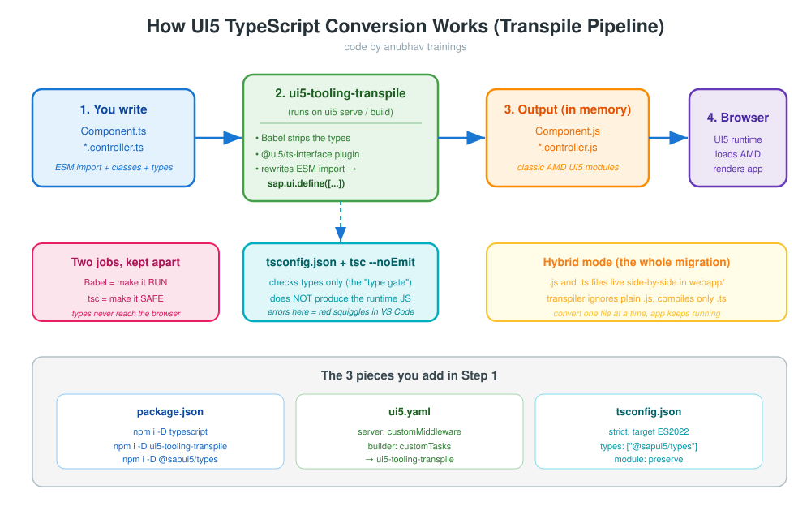

<h1 align="center">🧩 Step 1 — Preparation for UI5 TypeScript Conversion</h1>

<p align="center"><em>Install the transpiler, wire up <code>ui5.yaml</code>, add <code>tsconfig.json</code>, then convert exactly <strong>one</strong> controller to prove that JavaScript and TypeScript can live together.</em></p>

<p align="center"><sub><b>code by anubhav trainings</b></sub></p>

---

## 🧾 Cheat Sheet

| Action | Command / File | Why |
|--------|----------------|-----|
| Install transpiler | `npm i -D ui5-tooling-transpile` | turns `.ts` into UI5-style `.js` on the fly |
| Install compiler | `npm i -D typescript` | the `tsc` type-checker |
| Install UI5 types | `npm i -D @openui5/ts-types-esm` | teaches TypeScript what `sap.m.Button` etc. look like |
| Install live reload | `npm i -D ui5-middleware-livereload` | auto-refreshes the browser when a `.ts`/view file is saved |
| Add middleware | `ui5.yaml` → `server.customMiddleware` | transpile while you **serve** |
| Add build task | `ui5.yaml` → `builder.customTasks` | transpile while you **build** |
| Add compiler config | `tsconfig.json` | tells `tsc` how strict to be |
| First conversion | `Empty.controller.js` ➜ `Empty.controller.ts` | smallest file = safest test |
| Verify | `ui5 serve` then open the app | JS + TS hybrid must still render |

<div style="background-color:#e8f5e9; border-left: 5px solid #4caf50; padding: 10px 15px; border-radius: 4px;">
<em>💡 <strong>Goal of Step 1:</strong> not to convert the app — just to <strong>switch the engine on</strong>. By the end, the build understands TypeScript, and we have converted one tiny file to prove the pipeline works.</em>
</div>

---

## 1.0 — The concept: why a transpiler at all?

<div style="background-color:#e8f5e9; border-left: 5px solid #4caf50; padding: 10px 15px; border-radius: 4px;">
<em>💡 <strong>Concept — transpile:</strong> "transpile" = translate source code from one form to another form that does the same thing. The browser's UI5 runtime only understands the old <code>sap.ui.define([...], function(){...})</code> style. TypeScript files use modern <code>import</code> and <code>class</code>. The transpiler <strong>translates</strong> our modern TS back into the old style — and deletes the type annotations on the way out.</em>
</div>



Read the picture left to right: **you write `.ts`** ➜ **`ui5-tooling-transpile` (Babel) translates it** ➜ **plain `.js` comes out** ➜ **the browser runs the `.js`**. A second, separate tool (`tsc`) only checks types — it is the "spell-checker", it never produces the file the browser runs.

<div style="background-color:#fce4ec; border-left: 5px solid #e91e63; padding: 10px 15px; border-radius: 4px;">
📌 <strong>Note:</strong> Because the types are <strong>erased</strong> before the browser sees anything, TypeScript costs <strong>zero</strong> runtime performance. It is a tool for the developer, not for the user's browser.
</div>

---

## 1.1 — Install the three dev dependencies

Run these in the **root of the `manageorder` project** (the folder that holds `ui5.yaml`):

```bash
npm install --save-dev typescript
npm install --save-dev ui5-tooling-transpile
npm install --save-dev @openui5/ts-types-esm
npm install --save-dev @ui5/cli
npm install --save-dev ui5-middleware-livereload
```

<sub><b>code by anubhav trainings</b></sub>

<div style="background-color:#e8f5e9; border-left: 5px solid #4caf50; padding: 10px 15px; border-radius: 4px;">
<em>💡 <strong>Concept — <code>--save-dev</code>:</strong> these tools are only needed on the <strong>developer's machine</strong> (to build the app), never inside the shipped app. So they go in <code>devDependencies</code>, not <code>dependencies</code>.</em>
</div>

What each dev dependency is for:

| Package | Version | Job in plain words |
|---------|---------|--------------------|
| `typescript` | `^5.3.0` | the compiler/type-checker (`tsc`) that understands `.ts` and reports type errors |
| `@openui5/ts-types-esm` | `^1.120.0` | the UI5 type definitions — teaches TypeScript every `sap/...` module (`Button`, `Controller`, …) |
| `ui5-tooling-transpile` | `^3.2.0` | the Babel-based transpiler that turns your `.ts` into UI5-style `.js` on serve/build |
| `@ui5/cli` | `^4.0.0` | the `ui5` command itself (`ui5 serve`, `ui5 build`) — the engine the above plug into |
| `ui5-middleware-livereload` | `^3.1.4` | watches your source and **auto-refreshes the browser** the instant you save a file |

<sub><b>code by anubhav trainings</b></sub>

<div style="background-color:#e8f5e9; border-left: 5px solid #4caf50; padding: 10px 15px; border-radius: 4px;">
<em>💡 <strong>Concept — <code>^</code> (caret) versions:</strong> <code>^1.120.0</code> means "install <code>1.120.0</code> or any newer <code>1.x</code>, but never <code>2.0</code>". So even though the app boots UI5 <code>1.149.0</code>, the caret on <code>@openui5/ts-types-esm ^1.120.0</code> happily pulls the latest matching <code>1.x</code> types — staying compatible without you re-pinning the number on every UI5 patch.</em>
</div>

<div style="background-color:#fce4ec; border-left: 5px solid #e91e63; padding: 10px 15px; border-radius: 4px;">
📌 <strong>Note — why <code>ui5-middleware-livereload</code>?</strong> Without it you must press <kbd>F5</kbd> after every change. With it, saving a <code>.ts</code> controller or an <code>.xml</code> view reloads the running app automatically — a big time-saver during the many small conversions ahead. It is a <strong>serve-only</strong> middleware, so we register it in <code>ui5.yaml</code> alongside the transpiler (see §1.2) and it never ships to production.
</div>

### Old vs New — `package.json`

<table>
<tr>
<th>❌ Before (JavaScript only)</th>
<th>✅ After (TypeScript-ready)</th>
</tr>
<tr>
<td valign="top">

```json
{
  "name": "manageorder",
  "version": "0.0.1",
  "description": "An SAP Fiori application.",
  "keywords": ["ui5", "openui5", "sapui5"],
  "main": "webapp/index.html",
  "scripts": {
    "deploy-config": "npx -p @sap/ux-ui5-tooling fiori add deploy-config cf"
  },
  "devDependencies": { }
}
```

</td>
<td valign="top">

```json
{
  "name": "manageorder",
  "version": "0.0.1",
  "description": "An SAP Fiori application.",
  "keywords": ["ui5", "openui5", "sapui5"],
  "main": "webapp/index.html",
  "scripts": {
    "deploy-config": "npx -p @sap/ux-ui5-tooling fiori add deploy-config cf",
    "start": "ui5 serve --open index.html",
    "build": "ui5 build --clean-dest",
    "ts-typecheck": "tsc --noEmit"
  },
  "devDependencies": {
    "@openui5/ts-types-esm": "^1.120.0",
    "@ui5/cli": "^4.0.0",
    "typescript": "^5.3.0",
    "ui5-tooling-transpile": "^3.2.0",
    "ui5-middleware-livereload": "^3.1.4"
  }
}
```

</td>
</tr>
</table>

<sub><b>code by anubhav trainings</b></sub>

<div style="background-color:#fce4ec; border-left: 5px solid #e91e63; padding: 10px 15px; border-radius: 4px;">
📌 <strong>Note:</strong> Keep the <code>@openui5/ts-types-esm</code> major line aligned with the UI5 version your app bootstraps with. This app loads <code>1.149.0</code> in <code>webapp/index.html</code>; the caret range <code>^1.120.0</code> resolves to the newest <code>1.x</code> types (so it happily covers <code>1.149</code>) without you re-pinning on every patch. Mismatched <em>major</em> versions = wrong autocomplete. (<code>@openui5/ts-types-esm</code> is the free OpenUI5 type set; the SAPUI5 equivalent is <code>@sapui5/types</code> — pick one and stay consistent.)
</div>

---

## 1.2 — Wire the transpiler into `ui5.yaml`

<div style="background-color:#e8f5e9; border-left: 5px solid #4caf50; padding: 10px 15px; border-radius: 4px;">
<em>💡 <strong>Concept — middleware vs task:</strong> <code>ui5 serve</code> runs a tiny web server while you develop — a <strong>middleware</strong> plugs into that server and transpiles each <code>.ts</code> file the moment the browser asks for it. <code>ui5 build</code> produces the final <code>dist/</code> folder for deployment — a <strong>task</strong> plugs into that build. We register the transpiler in <strong>both</strong> so dev and production behave the same.</em>
</div>

### Old vs New — `ui5.yaml`

<table>
<tr>
<th>❌ Before</th>
<th>✅ After</th>
</tr>
<tr>
<td valign="top">

```yaml
specVersion: "2.5"
metadata:
  name: com.ats.manageorder
type: application
```

</td>
<td valign="top">

```yaml
specVersion: "3.0"
metadata:
  name: com.ats.manageorder
type: application
builder:
  customTasks:
    - name: ui5-tooling-transpile-task
      afterTask: replaceVersion
      configuration:
        debugInformation: true
        transpileDependencies: false
server:
  customMiddleware:
    - name: ui5-tooling-transpile-middleware
      afterMiddleware: compression
      configuration:
        debugInformation: true
    - name: ui5-middleware-livereload
      afterMiddleware: compression
      configuration:
        debug: true
        ext: "html,js,json,ts,xml,properties"
        port: 35729
        path: "webapp"
```

</td>
</tr>
</table>

<sub><b>code by anubhav trainings</b></sub>

What each new line means, in plain words:

- **`specVersion: "3.0"`** — custom tasks/middleware need the newer spec version (we bump from `2.5`).
- **`builder.customTasks`** — the transpiler that runs during `ui5 build`.
- **`server.customMiddleware`** — the transpiler that runs during `ui5 serve`.
- **`afterTask` / `afterMiddleware`** — *when* in the pipeline our transpiler runs (after compression / after the version is replaced).
- **`debugInformation: true`** — keeps source maps so the browser debugger shows your **`.ts`** code, not the generated `.js`.
- **`ui5-middleware-livereload`** — the second middleware: it watches the file types in `ext` (note we include `ts` and `xml`) and reloads the browser on save. `port: 35729` is the standard LiveReload port; `path: "webapp"` is the folder it watches.

<div style="background-color:#fce4ec; border-left: 5px solid #e91e63; padding: 10px 15px; border-radius: 4px;">
📌 <strong>Note:</strong> The names <code>ui5-tooling-transpile-task</code> and <code>ui5-tooling-transpile-middleware</code> are <strong>fixed</strong> — they are defined by the package you installed. A typo here means UI5 silently skips transpiling and your <code>.ts</code> files will 404 in the browser.
</div>

---

## 1.3 — Add `tsconfig.json`

<div style="background-color:#e8f5e9; border-left: 5px solid #4caf50; padding: 10px 15px; border-radius: 4px;">
<em>💡 <strong>Concept — <code>tsconfig.json</code>:</strong> the rule-book for the TypeScript compiler. It answers three questions: <strong>(1)</strong> which files to check, <strong>(2)</strong> how modern the JavaScript may be, and <strong>(3)</strong> how strict to be about mistakes.</em>
</div>

Create a new file **`tsconfig.json`** at the project root (next to `ui5.yaml`). TypeScript allows comments in `tsconfig.json`, so we keep the explanations right inside the file:

```jsonc
{
  "compilerOptions": {

    // JavaScript version to compile TO.
    // ES2022 = class fields, async/await, optional chaining (?.),
    // nullish coalescing (??), private members (#). UI5 1.120+ supports it.
    "target": "ES2022",

    // Module system of the OUTPUT — ECMAScript Modules (import/export).
    // ui5-tooling-transpile rewrites these into UI5's sap.ui.define(...) format.
    "module": "ES2022",

    // How import paths resolve to real files.
    // "bundler" reads package.json "exports" and matches the UI5 toolchain
    // (and tools like vite/webpack). Modern recommended setting.
    "moduleResolution": "bundler",

    // Skip type-checking the .d.ts files in node_modules — faster builds,
    // no noise from third-party type packages.
    "skipLibCheck": true,

    // Let .js and .ts files live together — essential for gradual migration.
    // Once 100% TypeScript you may set this to false.
    "allowJs": true,

    // strict:false → we adopt strictness GRADUALLY via the flags below,
    // instead of turning on every strict rule at once.
    "strict": false,

    // Every value must have a known type — no silent "any".
    "noImplicitAny": true,

    // When overriding a parent-class method you MUST write the 'override'
    // keyword. Stops accidental name clashes with the UI5 base classes.
    "noImplicitOverride": true,

    // Allow @decorator syntax used by some advanced UI5 TS patterns.
    "experimentalDecorators": true,

    // Emit .js.map files so DevTools shows your original .ts when debugging.
    "sourceMap": true,

    // Built-in type libraries: ES2022 standard library + browser DOM
    // (window, document, history…). DOM is needed e.g. for window.history.go().
    "lib": ["ES2022", "DOM"],

    // UI5 type-definitions package — provides every "sap/..." module declaration.
    "types": ["@openui5/ts-types-esm"],

    // Map the app namespace to its source folder (compile-time resolution only;
    // at runtime UI5's loader resolves the real files).
    "paths": {
      "com/ats/manageorder/*": ["./webapp/*"]
    }
  },

  // Compile everything under webapp/
  "include": ["./webapp/**/*"],

  // Ignore these during compilation
  "exclude": ["node_modules", "dist", "**/*.d.ts"]
}
```

<sub><b>code by anubhav trainings</b></sub>

The lines that matter most for a school-simple explanation:

- **`"target": "ES2022"`** — "you may write modern JavaScript; the transpiler handles old browsers".
- **`"moduleResolution": "bundler"`** — resolves imports the same way the UI5 toolchain does (reads the `exports` map), so `sap/...` and your own namespace both line up.
- **`"allowJs": true`** — *the magic switch for hybrid mode*: it lets `.js` and `.ts` files sit in the same project without complaints.
- **`"strict": false` + individual flags** — instead of switching on *every* strict rule at once, we turn on the ones we want now (`noImplicitAny`, `noImplicitOverride`) and tighten later. This keeps a real-world migration moving.
- **`"noImplicitOverride": true`** — any method that overrides a UI5 base method (like `init` or `onInit`) must say `override`. We will see this in Steps 2 and 3.
- **`"lib": ["ES2022", "DOM"]`** — teaches TypeScript about browser objects like `window` and `document` (used by `View3`'s back-navigation).
- **`"types": ["@openui5/ts-types-esm"]`** — loads the UI5 type definitions so `sap.m.Button`, `Controller`, etc. are known.
- **`"paths"`** — maps the app's namespace `com/ats/manageorder/...` to the `webapp/` folder, so imports resolve correctly.

<div style="background-color:#fce4ec; border-left: 5px solid #e91e63; padding: 10px 15px; border-radius: 4px;">
📌 <strong>Note:</strong> <code>allowJs: true</code> is the line that makes the <strong>whole gradual migration possible</strong>. Remove it and TypeScript would demand every file be <code>.ts</code> on day one — exactly the "big bang" we are avoiding.
</div>

<div style="background-color:#fce4ec; border-left: 5px solid #e91e63; padding: 10px 15px; border-radius: 4px;">
📌 <strong>Note — <code>noImplicitOverride</code> has a visible effect:</strong> from here on, every lifecycle hook that overrides a UI5 base method must be written with the <code>override</code> keyword (e.g. <code>public override init()</code>, <code>public override onInit()</code>). If you forget it, the compiler raises <code>TS4114: This member must have an 'override' modifier</code>. Steps 2 and 3 already use <code>override</code> everywhere it is required.
</div>

---

## 1.4 — Convert ONE controller (the proof)

We pick **`Empty.controller.js`** because it is the smallest file in the project — if anything is wrong with the setup, we find out with the least risk.

<div style="background-color:#e8f5e9; border-left: 5px solid #4caf50; padding: 10px 15px; border-radius: 4px;">
<em>💡 <strong>Concept — from <code>sap.ui.define</code> to <code>class</code>:</strong> The old style passes a list of dependency strings and a matching function. The TypeScript style uses <code>import</code> (one line per dependency) and an <code>export default class</code>. The transpiler turns the new style back into the old style for the browser — so they are <strong>equivalent</strong>, just easier to read and type-check.</em>
</div>

**Action:** rename `webapp/controller/Empty.controller.js` to `webapp/controller/Empty.controller.ts` and replace its body.

### Old vs New — `Empty.controller`

<table>
<tr>
<th>❌ Before — <code>Empty.controller.js</code></th>
<th>✅ After — <code>Empty.controller.ts</code></th>
</tr>
<tr>
<td valign="top">

```js
sap.ui.define(
    ["com/ats/manageorder/controller/BaseController"],
    function (BaseController) {
        return BaseController.extend(
            "com.ats.manageorder.controller.Empty", {

        });
    }
);
```

</td>
<td valign="top">

```ts
import BaseController from "./BaseController";

/**
 * Empty placeholder pane.
 * Same behaviour as before — just typed.
 */
export default class Empty extends BaseController {
    // no logic yet; the class body stays empty
}
```

</td>
</tr>
</table>

<sub><b>code by anubhav trainings</b></sub>

Line-by-line, what changed and why:

| Old JS | New TS | Reason |
|--------|--------|--------|
| `sap.ui.define([...], function(){...})` | `import ...` + `export default class` | modern module syntax the transpiler converts back |
| dependency **string** `"com/ats/manageorder/controller/BaseController"` | **relative import** `"./BaseController"` | TS resolves the path; shorter and checkable |
| `BaseController.extend("...Empty", {})` | `class Empty extends BaseController {}` | real class inheritance, with the name as the class name |
| no return type info | the compiler now *knows* `Empty` is a `Controller` | autocomplete + error checking |

<div style="background-color:#fce4ec; border-left: 5px solid #e91e63; padding: 10px 15px; border-radius: 4px;">
📌 <strong>Note:</strong> The string name <code>"com.ats.manageorder.controller.Empty"</code> disappears from the source. The transpiler re-creates it automatically from the file path during build, so the UI5 runtime still finds the controller by its full name. The XML view's <code>controllerName="com.ats.manageorder.controller.Empty"</code> keeps working unchanged.
</div>

---

## 1.5 — Verify the hybrid setup

Run the dev server from the project root:

```bash
npm run start
```

<sub><b>code by anubhav trainings</b></sub>

Then check three things:

1. ✅ The terminal shows **no transpile errors**.
2. ✅ The app opens in the browser and **renders exactly as before**.
3. ✅ All the **other controllers are still `.js`** and still work — that is the hybrid proof.

<div style="background-color:#e8f5e9; border-left: 5px solid #4caf50; padding: 10px 15px; border-radius: 4px;">
<em>💡 <strong>What "hybrid" means here:</strong> at this exact moment your <code>webapp/controller/</code> folder contains <strong>six <code>.js</code> files and one <code>.ts</code> file</strong>, and the app runs perfectly. That mixed state is normal and will continue for the next two steps.</em>
</div>

<div style="background-color:#fce4ec; border-left: 5px solid #e91e63; padding: 10px 15px; border-radius: 4px;">
📌 <strong>Note:</strong> If the app shows a blank page, open the browser console. A <code>404 Empty.controller.js</code> usually means the middleware name in <code>ui5.yaml</code> is misspelled, so the <code>.ts</code> was never transpiled.
</div>

---

## ✅ Final versions after Step 1

<details open>
<summary><b>tsconfig.json</b> (new file)</summary>

```jsonc
{
  "compilerOptions": {
    "target": "ES2022",
    "module": "ES2022",
    "moduleResolution": "bundler",
    "skipLibCheck": true,
    "allowJs": true,
    "strict": false,
    "noImplicitAny": true,
    "noImplicitOverride": true,
    "experimentalDecorators": true,
    "sourceMap": true,
    "lib": ["ES2022", "DOM"],
    "types": ["@openui5/ts-types-esm"],
    "paths": {
      "com/ats/manageorder/*": ["./webapp/*"]
    }
  },
  "include": ["./webapp/**/*"],
  "exclude": ["node_modules", "dist", "**/*.d.ts"]
}
```

</details>

<details>
<summary><b>ui5.yaml</b> (updated)</summary>

```yaml
specVersion: "3.0"
metadata:
  name: com.ats.manageorder
type: application
builder:
  customTasks:
    - name: ui5-tooling-transpile-task
      afterTask: replaceVersion
      configuration:
        debugInformation: true
        transpileDependencies: false
server:
  customMiddleware:
    - name: ui5-tooling-transpile-middleware
      afterMiddleware: compression
      configuration:
        debugInformation: true
    - name: ui5-middleware-livereload
      afterMiddleware: compression
      configuration:
        debug: true
        ext: "html,js,json,ts,xml,properties"
        port: 35729
        path: "webapp"
```

</details>

<details>
<summary><b>webapp/controller/Empty.controller.ts</b> (converted)</summary>

```ts
import BaseController from "./BaseController";

/**
 * Empty placeholder pane.
 * Same behaviour as before — just typed.
 */
export default class Empty extends BaseController {
    // no logic yet; the class body stays empty
}
```

</details>

<sub><b>code by anubhav trainings</b></sub>

---

<p align="center">➡️ Next: <a href="step2_component_formatter.md"><b>Step 2 — Convert Component & formatter</b></a></p>

<p align="center"><sub><b>code by anubhav trainings</b></sub></p>
