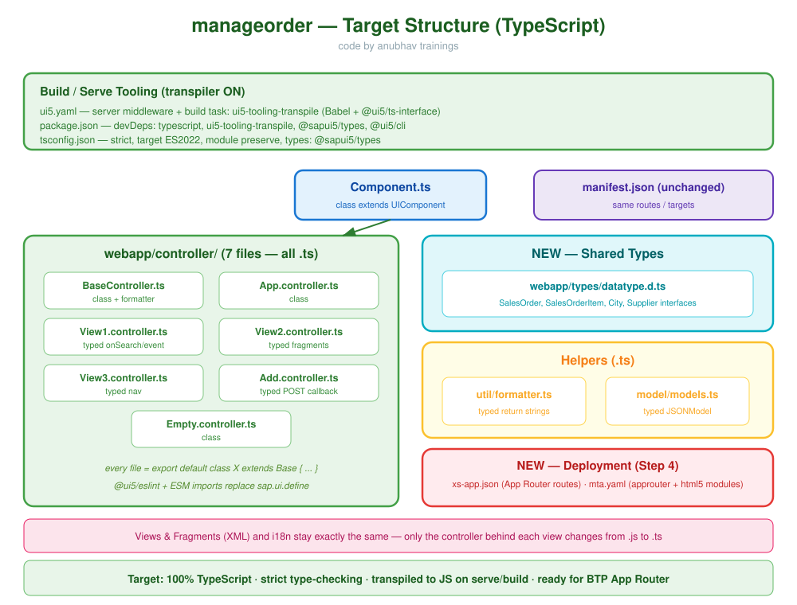

<h1 align="center">🚏 Step 4 — App Router & MTA Deployment</h1>

<p align="center"><em>Add an App Router (<code>xs-app.json</code>), describe the whole app in <code>mta.yaml</code> for Cloud Foundry, and make the TypeScript <strong>type gate</strong> pass — so the migrated app is ready to deploy on SAP BTP.</em></p>

<p align="center"><sub><b>code by anubhav trainings</b></sub></p>

---

## 🧾 Cheat Sheet

| Piece | File / Command | Purpose |
|-------|------|---------|
| Scaffold router | `cds add approuter` **or** `cd app/router && npm i @sap/approuter` | create the App Router module |
| Route rules | `app/router/xs-app.json` | tells the App Router how to forward each URL |
| Module descriptor | `mta.yaml` | lists app + approuter + html5-repo for CF deploy |
| Build the app | `ui5 build --clean-dest` | produces the static `dist/` to upload |
| Type gate | `npm run ts-typecheck` (`tsc --noEmit`) | must print **zero** errors before deploy |
| Build the MTA | `mbt build` | bundles everything into one `.mtar` |
| Deploy | `cf deploy mta_archives/*.mtar` | push to Cloud Foundry |

<div style="background-color:#e8f5e9; border-left: 5px solid #4caf50; padding: 10px 15px; border-radius: 4px;">
<em>💡 <strong>Goal of Step 4:</strong> the app is now fully TypeScript and runs locally. This step makes it <strong>deployable to SAP BTP</strong>: a router to serve it, an MTA descriptor to package it, and a green type gate to guarantee quality.</em>
</div>

---

## 4.0 — Concept: what is an App Router?

<div style="background-color:#e8f5e9; border-left: 5px solid #4caf50; padding: 10px 15px; border-radius: 4px;">
<em>💡 <strong>Concept — App Router:</strong> on SAP BTP your Fiori app does not talk to the backend directly. A small gatekeeper called the <strong>App Router</strong> sits in front. It does three jobs: <strong>(1)</strong> serve your static UI5 files, <strong>(2)</strong> forward <code>/odata/...</code> calls to the real service (a "destination"), and <strong>(3)</strong> handle login/authentication. <code>xs-app.json</code> is its instruction sheet.</em>
</div>

<div style="background-color:#fce4ec; border-left: 5px solid #e91e63; padding: 10px 15px; border-radius: 4px;">
📌 <strong>Note:</strong> Locally, <code>ui5 serve</code> already proxies requests for you, so you never needed an App Router during Steps 1–3. It only becomes essential when the app leaves your laptop and lives on BTP.
</div>

---

## 4.1 — Scaffold the App Router module

The App Router is its **own little Node.js app** — a separate folder with its own `package.json` that depends on `@sap/approuter`. We create it next to the UI app, at **`app/router/`**. There are two ways to do it; pick one.

<div style="background-color:#e8f5e9; border-left: 5px solid #4caf50; padding: 10px 15px; border-radius: 4px;">
<em>💡 <strong>Concept — why a separate folder?</strong> Your UI5 app is <em>static files</em> (HTML/JS/CSS). The App Router is a <em>running program</em> that serves those files and proxies the OData calls. Two different jobs ⇒ two different modules. On BTP they deploy as separate things, so we keep them in separate folders from the start.</em>
</div>

### Option A — `cds add approuter` (recommended in a CAP project)

Because `manageorder` lives inside the CAP project `capm-s4-mashup`, the CAP CLI can scaffold the router **and** wire it into `mta.yaml`/`package.json` for you:

```bash
# from the CAP project root: capm-s4-mashup/
cds add approuter
```

<sub><b>code by anubhav trainings</b></sub>

This generates the **`app/router/`** folder containing a ready `package.json` (with the `@sap/approuter` dependency and a `start` script) and a starter `xs-app.json`, and registers an approuter module in your MTA descriptor. You then just edit the generated `xs-app.json` (§4.2).

<div style="background-color:#fce4ec; border-left: 5px solid #e91e63; padding: 10px 15px; border-radius: 4px;">
📌 <strong>Note:</strong> <code>cds add approuter</code> needs the <code>@sap/cds-dk</code> tooling (the global <code>cds</code> command). If you also run <code>cds add html5-repo</code> and <code>cds add xsuaa</code>, CAP fills in most of the <code>mta.yaml</code> from §4.3 automatically — a big time-saver over writing it by hand.
</div>

### Option B — Create it manually with `npm`

If you are not in a CAP project (or want to see every moving part), build the folder yourself:

```bash
# from the project root
cd app
mkdir router
cd router
npm init -y                 # creates a default package.json
npm install @sap/approuter  # adds the App Router runtime
```

<sub><b>code by anubhav trainings</b></sub>

Then open the generated `app/router/package.json` and add a `start` script so the folder can run on its own:

```json
{
  "name": "manageorder-approuter",
  "version": "1.0.0",
  "description": "App Router for the manageorder Fiori app",
  "engines": {
    "node": ">=18"
  },
  "dependencies": {
    "@sap/approuter": "^20.4.0"
  },
  "scripts": {
    "start": "node node_modules/@sap/approuter/approuter.js"
  }
}
```

<sub><b>code by anubhav trainings</b></sub>

<div style="background-color:#e8f5e9; border-left: 5px solid #4caf50; padding: 10px 15px; border-radius: 4px;">
<em>💡 <strong>Concept — the <code>start</code> script:</strong> <code>@sap/approuter</code> ships a runnable file <code>approuter.js</code>. The <code>start</code> script just launches it with Node. On BTP, Cloud Foundry runs this same <code>npm start</code> to boot your router. Locally you can run it too (with a <code>default-env.json</code> holding test destinations), but that is optional for this guide.</em>
</div>

### Where everything sits now

After either option, the project tree looks like this:

```text
capm-s4-mashup/
├─ app/
│  ├─ manageorder/        ← the UI5 TypeScript app (Steps 1–3)
│  │  ├─ webapp/
│  │  └─ ui5.yaml
│  └─ router/             ← NEW: the App Router module
│     ├─ package.json     ← @sap/approuter + start script
│     └─ xs-app.json      ← the route rules (next section)
├─ srv/                   ← CAP service (the OData backend)
├─ db/
└─ mta.yaml               ← ties it all together for deploy
```

<sub><b>code by anubhav trainings</b></sub>

<div style="background-color:#fce4ec; border-left: 5px solid #e91e63; padding: 10px 15px; border-radius: 4px;">
📌 <strong>Note:</strong> The folder name <code>app/router</code> is the CAP convention used by <code>cds add approuter</code>. Whatever you name it, it must match the <code>path:</code> of the approuter module in <code>mta.yaml</code> (we use <code>path: app/router</code> in §4.3).
</div>

---

## 4.2 — Add `xs-app.json` (the router's rule sheet)

Now fill in the router's instruction file **`app/router/xs-app.json`** (Option A created a starter; replace its contents with this):

```json
{
  "welcomeFile": "/index.html",
  "authenticationMethod": "route",
  "routes": [
    {
      "source": "^/odata/v4/catalog/(.*)$",
      "target": "/odata/v4/catalog/$1",
      "destination": "manageorder-srv",
      "authenticationType": "xsuaa"
    },
    {
      "source": "^/resources/(.*)$",
      "target": "/resources/$1",
      "authenticationType": "none",
      "destination": "ui5"
    },
    {
      "source": "^(.*)$",
      "target": "$1",
      "service": "html5-apps-repo-rt",
      "authenticationType": "xsuaa"
    }
  ]
}
```

<sub><b>code by anubhav trainings</b></sub>

Reading each route like a school rule:

- **Rule 1 — OData:** "any URL that starts with `/odata/v4/catalog/` → send it to the backend service named `manageorder-srv`, and require login (`xsuaa`)."
- **Rule 2 — UI5 library:** "anything under `/resources/` → fetch the UI5 framework from the `ui5` destination, no login needed."
- **Rule 3 — everything else:** "all other URLs → serve my static app files from the HTML5 repository."

<div style="background-color:#e8f5e9; border-left: 5px solid #4caf50; padding: 10px 15px; border-radius: 4px;">
<em>💡 <strong>Concept — order matters:</strong> the App Router checks routes <strong>top to bottom</strong> and uses the <em>first</em> match. The catch-all <code>^(.*)$</code> must be <strong>last</strong>, or it would swallow the OData calls before they reach Rule 1.</em>
</div>

---

## 4.3 — Add the app to `mta.yaml`

<div style="background-color:#e8f5e9; border-left: 5px solid #4caf50; padding: 10px 15px; border-radius: 4px;">
<em>💡 <strong>Concept — MTA (Multi-Target Application):</strong> a single recipe that lists every moving part of your solution — the UI, the router, the service bindings — so the whole thing deploys together with one command. <code>mta.yaml</code> is that recipe.</em>
</div>

Create **`mta.yaml`** at the project root:

```yaml
_schema-version: "3.2"
ID: com.ats.manageorder
version: 0.0.1
description: "Manage Order - SAPUI5 TypeScript app"

parameters:
  enable-parallel-deployments: true

build-parameters:
  before-all:
    - builder: custom
      commands:
        - npm ci
        - npm run build          # ui5 build → transpiles TS to JS into dist/

modules:
  # 1) the static UI5 app, packaged for the HTML5 repo
  - name: manageorder-ui
    type: html5
    path: .
    build-parameters:
      build-result: dist
      builder: custom
      commands:
        - npm run build
      supported-platforms: []

  # 2) deployer that uploads the UI to the HTML5 application repository
  - name: manageorder-ui-deployer
    type: com.sap.application.content
    requires:
      - name: manageorder-html5-repo-host
        parameters:
          content-target: true
    build-parameters:
      build-result: resources
      requires:
        - artifacts:
            - manageorder-ui.zip
          name: manageorder-ui
          target-path: resources/

  # 3) the App Router that serves the app and proxies OData
  - name: manageorder-approuter
    type: approuter.nodejs
    path: app/router
    requires:
      - name: manageorder-html5-repo-runtime
      - name: manageorder-uaa
      - name: manageorder-srv-api
        group: destinations
        properties:
          name: manageorder-srv
          url: ~{srv-url}
          forwardAuthToken: true

resources:
  - name: manageorder-html5-repo-host
    type: org.cloudfoundry.managed-service
    parameters:
      service: html5-apps-repo
      service-plan: app-host
  - name: manageorder-html5-repo-runtime
    type: org.cloudfoundry.managed-service
    parameters:
      service: html5-apps-repo
      service-plan: app-runtime
  - name: manageorder-uaa
    type: org.cloudfoundry.managed-service
    parameters:
      service: xsuaa
      service-plan: application
```

<sub><b>code by anubhav trainings</b></sub>

The three modules, in one sentence each:

- **`manageorder-ui`** — builds your TypeScript app into static files (`npm run build` runs the transpiler).
- **`manageorder-ui-deployer`** — uploads those static files into the BTP HTML5 repository.
- **`manageorder-approuter`** — the gatekeeper from §4.0, configured with the destinations and `xsuaa` login.

<div style="background-color:#fce4ec; border-left: 5px solid #e91e63; padding: 10px 15px; border-radius: 4px;">
📌 <strong>Note:</strong> The build step <code>npm run build</code> is what turns your <code>.ts</code> files into the <code>.js</code> the browser runs — via the <code>ui5-tooling-transpile-task</code> you registered in <code>ui5.yaml</code> back in Step 1. The cloud never sees your TypeScript; it only receives the transpiled <code>dist/</code> output.
</div>

---

## 4.4 — Pass the type gate

<div style="background-color:#e8f5e9; border-left: 5px solid #4caf50; padding: 10px 15px; border-radius: 4px;">
<em>💡 <strong>Concept — the "type gate":</strong> a single command, <code>tsc --noEmit</code>, that checks every <code>.ts</code> file for type errors <strong>without</strong> producing any output files (<code>--noEmit</code> = "check only, write nothing"). If it prints nothing, your types are sound. Teams run this in CI so broken types can never be deployed.</em>
</div>

Run it from the project root:

```bash
npm run ts-typecheck
```

Which (from the script we added in Step 1) runs:

```bash
tsc --noEmit
```

<sub><b>code by anubhav trainings</b></sub>

### What a passing vs failing gate looks like

<table>
<tr>
<th>❌ Gate FAILS (type error)</th>
<th>✅ Gate PASSES</th>
</tr>
<tr>
<td valign="top">

```text
> tsc --noEmit

webapp/controller/View1.controller.ts:42:39
  error TS2339: Property 'querry' does not
  exist on type 'SearchField$SearchEvent'.
  42   const s = oEvent.getParameter("querry");
                                      ~~~~~~~~

Found 1 error in 1 file.
```

</td>
<td valign="top">

```text
> tsc --noEmit

(no output)

# exit code 0 — clean.
# every .ts file type-checks.
# safe to build and deploy.
```

</td>
</tr>
</table>

<sub><b>code by anubhav trainings</b></sub>

<div style="background-color:#fce4ec; border-left: 5px solid #e91e63; padding: 10px 15px; border-radius: 4px;">
📌 <strong>Note:</strong> This is exactly the kind of typo (<code>"querry"</code> instead of <code>"query"</code>) that, in the original JavaScript app, would have shipped to production and only failed when a user typed in the search box. The type gate catches it on your machine, in seconds, for free.
</div>

---

## 4.5 — Build and deploy

```bash
# 1) prove types are clean
npm run ts-typecheck

# 2) bundle the whole MTA (UI + deployer + approuter)
mbt build

# 3) push to Cloud Foundry
cf deploy mta_archives/com.ats.manageorder_0.0.1.mtar
```

<sub><b>code by anubhav trainings</b></sub>

<div style="background-color:#e8f5e9; border-left: 5px solid #4caf50; padding: 10px 15px; border-radius: 4px;">
<em>💡 <strong>What just happened end-to-end:</strong> <code>mbt build</code> ran <code>npm run build</code>, which ran the UI5 transpiler, which turned every <code>.ts</code> into UI5-style <code>.js</code> in <code>dist/</code>. That <code>dist/</code> was zipped into the HTML5 repo, and the App Router was deployed in front of it. The browser downloads plain JavaScript — your TypeScript stayed on the build machine.</em>
</div>

---

## 🏁 Migration complete — before & after



| Aspect | Before (Step 0) | After (Step 4) |
|--------|-----------------|----------------|
| Language | 100% JavaScript | 100% TypeScript |
| Errors found | at runtime, in the browser | at compile time, in the editor |
| Build step | none | `ui5-tooling-transpile` |
| Shared shapes | duplicated inline | one `types/datatype.d.ts` |
| Deployment | manual | `mta.yaml` + App Router on BTP |
| Quality gate | none | `tsc --noEmit` green |

---

## ✅ Final new files after Step 4

<details open>
<summary><b>app/router/package.json</b></summary>

```json
{
  "name": "manageorder-approuter",
  "version": "1.0.0",
  "description": "App Router for the manageorder Fiori app",
  "engines": {
    "node": ">=18"
  },
  "dependencies": {
    "@sap/approuter": "^20.4.0"
  },
  "scripts": {
    "start": "node node_modules/@sap/approuter/approuter.js"
  }
}
```

</details>

<details open>
<summary><b>app/router/xs-app.json</b></summary>

```json
{
  "welcomeFile": "/index.html",
  "authenticationMethod": "route",
  "routes": [
    {
      "source": "^/odata/v4/catalog/(.*)$",
      "target": "/odata/v4/catalog/$1",
      "destination": "manageorder-srv",
      "authenticationType": "xsuaa"
    },
    {
      "source": "^/resources/(.*)$",
      "target": "/resources/$1",
      "authenticationType": "none",
      "destination": "ui5"
    },
    {
      "source": "^(.*)$",
      "target": "$1",
      "service": "html5-apps-repo-rt",
      "authenticationType": "xsuaa"
    }
  ]
}
```

</details>

<details>
<summary><b>mta.yaml</b></summary>

```yaml
_schema-version: "3.2"
ID: com.ats.manageorder
version: 0.0.1
description: "Manage Order - SAPUI5 TypeScript app"

parameters:
  enable-parallel-deployments: true

build-parameters:
  before-all:
    - builder: custom
      commands:
        - npm ci
        - npm run build

modules:
  - name: manageorder-ui
    type: html5
    path: .
    build-parameters:
      build-result: dist
      builder: custom
      commands:
        - npm run build
      supported-platforms: []

  - name: manageorder-ui-deployer
    type: com.sap.application.content
    requires:
      - name: manageorder-html5-repo-host
        parameters:
          content-target: true
    build-parameters:
      build-result: resources
      requires:
        - artifacts:
            - manageorder-ui.zip
          name: manageorder-ui
          target-path: resources/

  - name: manageorder-approuter
    type: approuter.nodejs
    path: app/router
    requires:
      - name: manageorder-html5-repo-runtime
      - name: manageorder-uaa
      - name: manageorder-srv-api
        group: destinations
        properties:
          name: manageorder-srv
          url: ~{srv-url}
          forwardAuthToken: true

resources:
  - name: manageorder-html5-repo-host
    type: org.cloudfoundry.managed-service
    parameters:
      service: html5-apps-repo
      service-plan: app-host
  - name: manageorder-html5-repo-runtime
    type: org.cloudfoundry.managed-service
    parameters:
      service: html5-apps-repo
      service-plan: app-runtime
  - name: manageorder-uaa
    type: org.cloudfoundry.managed-service
    parameters:
      service: xsuaa
      service-plan: application
```

</details>

<sub><b>code by anubhav trainings</b></sub>

---

<p align="center">🎉 <b>You migrated a freestyle SAP BTP Fiori app from JavaScript to TypeScript, end to end.</b></p>

<p align="center">⬅️ Back to the <a href="00_summary.md"><b>Summary</b></a></p>

<p align="center"><sub><b>code by anubhav trainings</b></sub></p>
