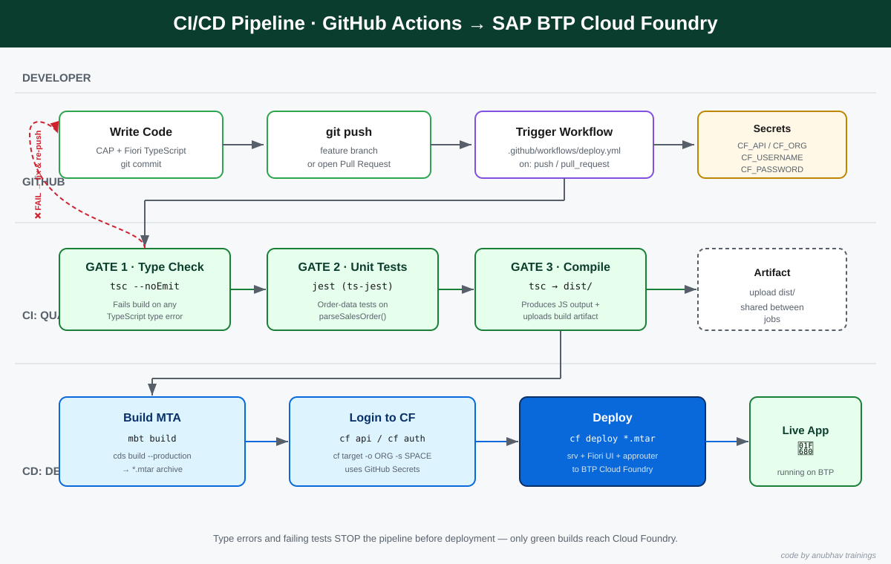

<h1 align="center">🚀 CI/CD for SAP BTP with GitHub Actions — Course Summary</h1>

<p align="center"><i>End-to-end guide: add TypeScript type-gates and Jest tests to a CAP + Freestyle Fiori app, then auto-deploy to Cloud Foundry.</i></p>

---

## 📋 Cheat Sheet (keep this open while you work)

> Every guide in this folder starts with this same cheat sheet so you always have the commands one scroll away.

### Cloud Foundry (cf) commands

```bash
# --- Login & target ---
cf api https://api.cf.<region>.hana.ondemand.com   # point the CLI at your BTP landscape
cf login                                            # interactive login (asks email + password)
cf auth "$CF_USERNAME" "$CF_PASSWORD"               # non-interactive login (used inside CI)
cf target -o <ORG> -s <SPACE>                       # choose org + space to work in

# --- Look around ---
cf orgs                 # list orgs you can access
cf spaces               # list spaces in the current org
cf apps                 # list deployed apps
cf services             # list service instances (xsuaa, html5-repo, ...)
cf logs <app> --recent  # show recent logs for one app

# --- Deploy (MTA = Multi-Target Application) ---
mbt build                       # build the project into one mta_archives/*.mtar file
cf deploy mta_archives/*.mtar   # push the whole MTA (srv + UI + approuter) to BTP
cf undeploy <mta-id> --delete-services   # remove everything again
```

<sub>⌨️ code by anubhav trainings</sub>

### Git & GitHub commands

```bash
git init                         # turn a folder into a git repository
git remote add origin <url>      # connect your local repo to GitHub
git checkout -b feature/my-work  # create + switch to a new branch
git add .                        # stage all changes
git commit -m "message"          # save a snapshot
git push -u origin feature/my-work   # upload the branch to GitHub
git revert <commit>              # undo a commit by making a new opposite commit
```

<sub>⌨️ code by anubhav trainings</sub>

### Node / TypeScript / test commands

```bash
npm ci                 # clean, reproducible install (used in CI)
npm run build:ts       # tsc — compile TypeScript
npx tsc --noEmit       # TYPE CHECK only — no files written (our quality gate)
npx jest               # run the unit tests
```

<sub>⌨️ code by anubhav trainings</sub>

---

## 🧭 The Big Picture

<div style="background-color:#e6ffed;border-left:6px solid #2da44e;padding:10px 16px;border-radius:6px;">
<em>🌱 <b>Concept — What is CI/CD?</b> <b>CI</b> (Continuous Integration) means: every time you push code, a robot automatically checks it (compiles it, runs tests). <b>CD</b> (Continuous Deployment) means: if all checks pass, that same robot ships the code to the cloud for you. No more "it works on my machine" surprises.</em>
</div>

<br/>

Think of it like a **factory conveyor belt with quality inspectors**. Your code rides the belt. At each inspection station a check runs. If the product fails inspection, the belt **stops** and the item goes back to you — it never reaches the customer. Only perfect items reach the end (Cloud Foundry).

In this course, our inspection stations (we call them **quality gates**) are:

1. **Type Check** — does the TypeScript even make sense? (`tsc --noEmit`)
2. **Unit Tests** — does our order-data logic behave correctly? (`jest`)
3. **Compile** — turn TypeScript into runnable JavaScript in `dist/` (`tsc`)

Only after all three are green do we **deploy** to SAP BTP Cloud Foundry.



---

## 🎓 The Use Case

We already built a real application in **Day 3** — `capm-s4-mashup`. It has two halves:

| Part | Folder | What it is |
|------|--------|------------|
| **CAP backend** | `srv/` | A TypeScript service (`CatalogService`) that reads & creates **Sales Orders** in S/4HANA |
| **Freestyle Fiori app** | `app/manageorder` | A SAPUI5 (TypeScript) front-end to *manage orders* |

The backend has a small but important piece of logic: [`parseSalesOrder()`](../../Day%203/capm-s4-mashup/srv/lib/payload-parser.ts) which **validates incoming order data** before it is sent to S/4HANA. That validator is exactly the kind of code a bug could sneak into — so it is the perfect thing to protect with **automated tests** and **type-gates**.

<div style="background-color:#ffe3ec;border-left:6px solid #e5476d;padding:10px 16px;border-radius:6px;">
📌 <b>Note:</b> We will <b>NOT change any application code</b> in this course. We only <i>add</i> new files: a couple of test files, a GitHub Actions workflow, and supporting config. The Day 3 app stays exactly as it is.
</div>

---

## 🗺️ The Phases

This guide is split into numbered markdown files. Do them **in order** — each one builds on the last.

### Phase 0 — Understand the tools
📄 **[01-introduction-to-github-actions.md](01-introduction-to-github-actions.md)**
> Learn what GitHub Actions is, the vocabulary (workflow, job, step, runner, secret, trigger), and how a `.yml` file becomes a running robot. No setup yet — just concepts.

### Phase 1 — Prerequisites & manual validation
📄 **[02-step1-prerequisites.md](02-step1-prerequisites.md)**
> Before automating, prove everything works **by hand**:
> - Add 2–3 small **Jest unit tests** on the order-data validator.
> - Run the CAP backend and the Fiori app locally and test them manually.
> - Generate a **GitHub PAT** (Personal Access Token).
> - Create a **new GitHub repository** and push the project.

### Phase 2 — Build the CI/CD pipeline with type-gates
📄 **[03-step2-cicd-type-gates.md](03-step2-cicd-type-gates.md)**
> Create `.github/workflows/deploy.yml` that:
> - Runs `tsc --noEmit` (type-check) as the **first gate**.
> - Runs `jest` tests **after** type-check.
> - Runs `tsc` to **compile** into `dist/` and **uploads it as an artifact**.
> - **Deploys** to Cloud Foundry only when all gates pass.
> - Then we **deliberately break the types** on a branch, watch the pipeline fail, and **revert** to watch it pass again.

---

## ✅ What you will be able to do at the end

- Explain CI/CD and GitHub Actions to someone else.
- Read and write a GitHub Actions `deploy.yml` workflow.
- Use **TypeScript compilation as a mandatory build gate**.
- Protect order-data logic with **Jest tests** that run automatically.
- Deploy a CAP + Fiori app to **SAP BTP Cloud Foundry** without typing a single deploy command by hand.
- **Prove** the safety net works by breaking it on purpose and fixing it.

<div style="background-color:#e6ffed;border-left:6px solid #2da44e;padding:10px 16px;border-radius:6px;">
<em>🌱 <b>Concept — Why "gates" matter:</b> A gate is a check that has the power to <b>stop</b> the pipeline. Without gates, broken code could deploy to real users. With gates, broken code is caught in seconds, on a robot, before anyone sees it.</em>
</div>

<br/>

➡️ **Start here:** [01-introduction-to-github-actions.md](01-introduction-to-github-actions.md)

<sub>⌨️ code by anubhav trainings</sub>
